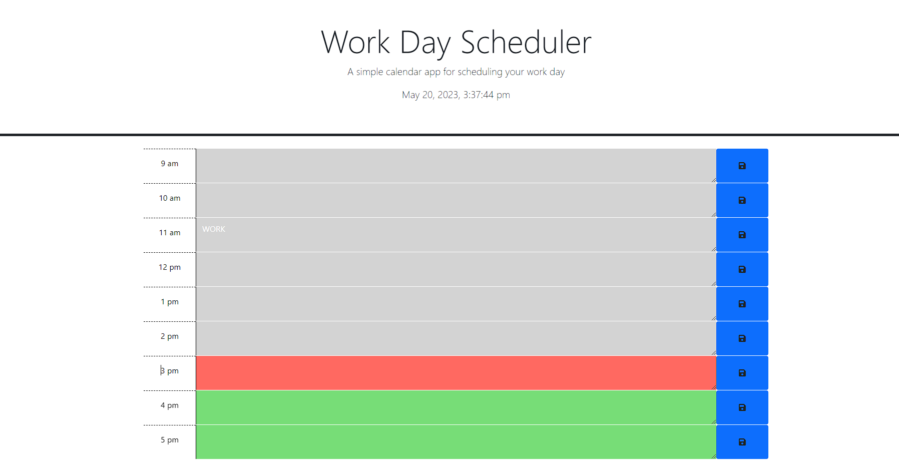

# Work-Day-Scheduler

## Description
By noticing the challenges faced by busy people in today's faced-paced world, I was motivated to build this website. I noticed many people have a hard time keeping track of their tasks and effectively manage their time, which leads to disorganization and uncompleted tasks. I wanted to solve this issue by creating a website that allows the user to have control of their daily routines. I wanted to create a practical tool that would enable users to efficiently plan and schedule their tasks, allowing them to stay on top of their commitments and prioritize effectively. The website I developed aims to solve the problem of disorganization and inefficiency in task management. By providing users with a user-friendly platform, they can schedule their day according to their preferences and allocate specific tasks to each hour. There are visual cues, such as color-coding past, present, and future tasks. This provides a clear overview and enhance the overall organization of their day. Throughout the project, I learned valuable skills and technologies while reinforcing the significance of user-centric design and practical problem-solving.

## Usage

type in the tasks you plan to fulfil in each hor slot. Press the blue button on the right to save the task. If the button turns green, it has been saved to local storage. You can reload the page and see the tasks have been saved. Note that a green button marks a saved task. If you want to add another task, you will have to save all the tasks you want to be saved. 
Preview:
;

## Credits
-dayjs
-jQuery widgets

## License
Refer to the LICENSE file in README.